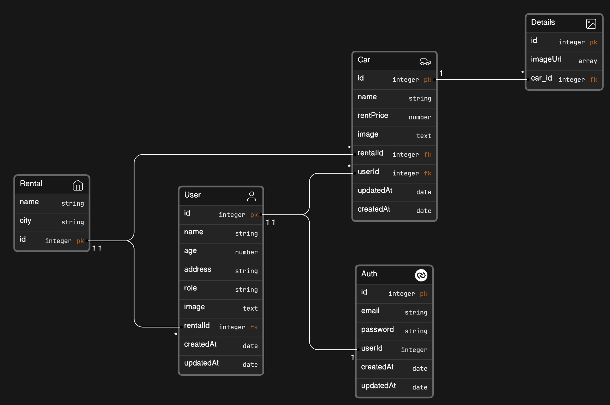

<div align="center">
  <h3> Tim 2 - API Car Management </h3>
</div>

<!-- ABOUT THE PROJECT -->

## About Project

- Anggota Tim
  Andhika Rizki Aulia
  Gita Marendes
  Hafiedz Hasmy Hamid
  Rafli Kharisma Akbar
  Rendi Hardiartama

<br>

- Pembagian Tugas
  Auths : Rendi
  Users : Gita
  Car : Andhika
  Rental : Hafiedz
  Details : Rafli

<br>

- Role Access
  Admin : Registrasi manager & staff, melihat semua data, dan update semua data
  Manager : Update Rental, melihat data di rentalnya, register staff, & update car di rentalnya
  Staff : Melihat data di rentalnya

### Database Diagram



### Built With

Tech stack atau framework yang digunakan pada aplikasi ini

<ul>
   <li> Express JS 
   <li> Postgres 
   <li> Sequelize 
</ul>

<!-- GETTING STARTED -->

## Getting Started

Berikut adalah contoh untuk memasuki folder aplikasi.

```bash
# Clone repository terlebih dahulu

git clone https://github.com/ndikrp/team2-API-car-management.git

cd team2-API-management

code .

```

### Prerequisites

Cara menjalankan aplikasi dan menginstall package yang dibutuhkan

1. Buat file .env terlebih dahulu dan isi dari file .env adalah sebagai berikut :

```bash
DB_USERNAME= # Username Postgres
DB_PASSWORD= # Password Postgres
DB_NAME= # Nama Database
DB_PORT= # Port Database
DB_HOST= # Host Database (localhost / 127.0.0.1)
PORT= # Port Aplikasi
JWT_SECRET= # Secret Key (bisa random)
JWT_EXPIRED= # Kapan Token JWT expire

# Variabel yang dibutuhkan untuk upload image ke imagekit
IMAGEKIT_PUBLIC_KEY=
IMAGEKIT_PRIVATE_KEY=
IMAGEKIT_URL=
```

2. Install package, dan jalankan aplikasi

```bash
# Install Package
npm install

# Membuat Database menggunakan sequelize-cli
npm run db:all

# Run Aplikasi
npm start
```

<!-- ROADMAP -->

## Progress

- [x] API
  - [x] API Auths
  - [x] API User
  - [x] API Car
  - [x] API Rental
  - [x] API Details
- [ ] Middleware
- [ ] Validasi Tiap API / Resources
- [ ] Dokumentasi API

<!-- API Docs -->

## API Documentaion

soon...

<!-- LICENSE -->

## License

Distributed under the MIT License. See `LICENSE.txt` for more information.
